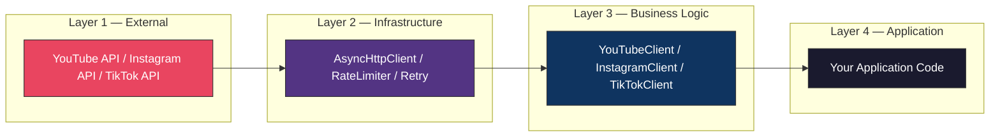
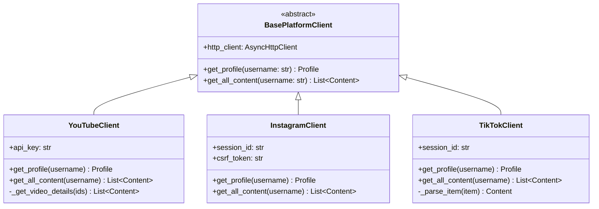
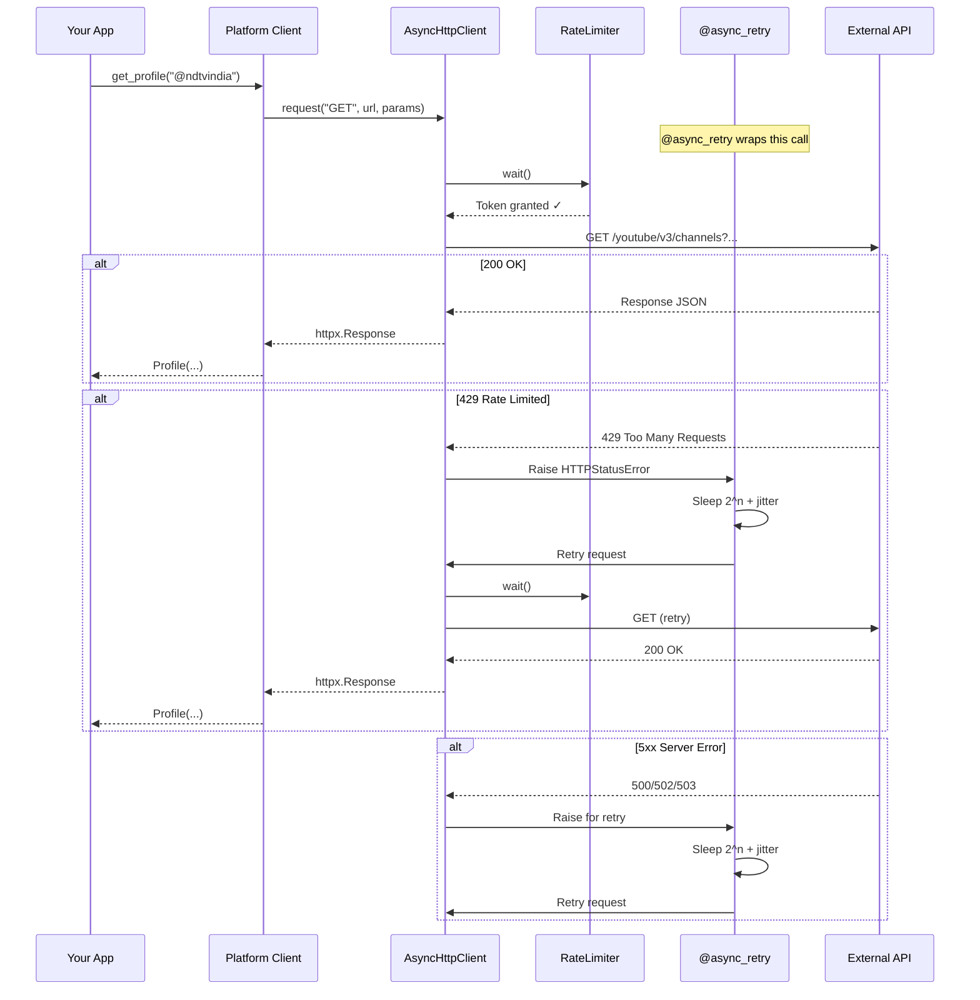
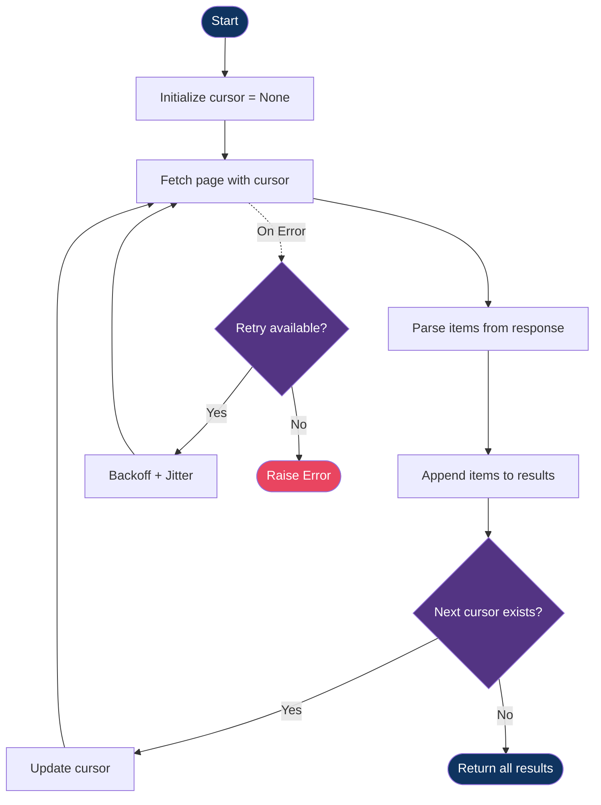
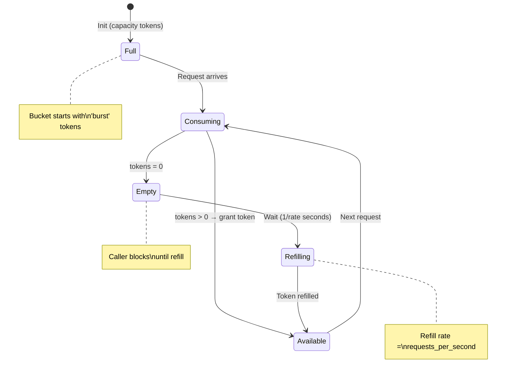
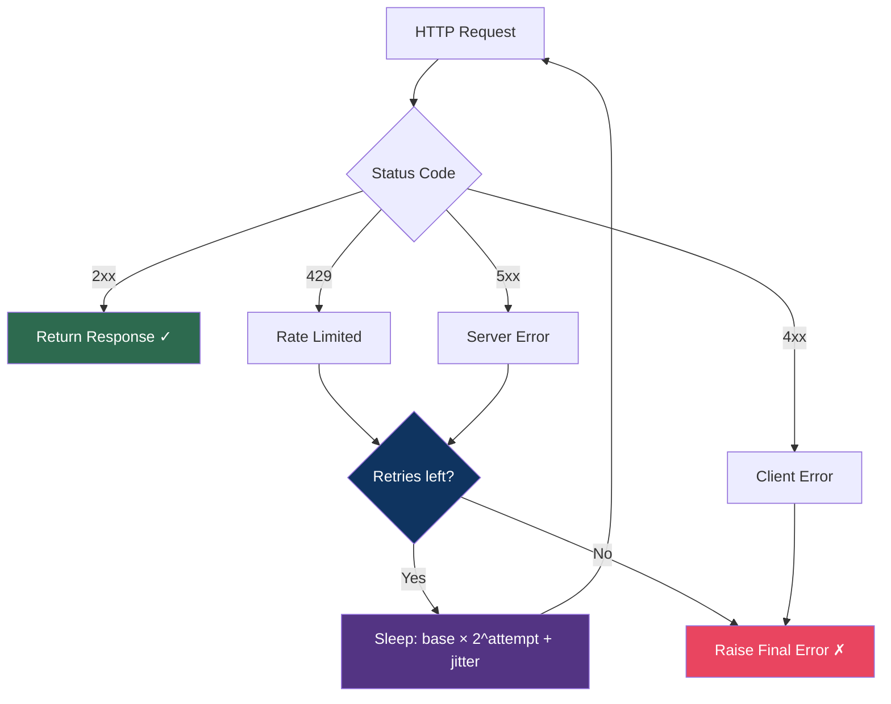
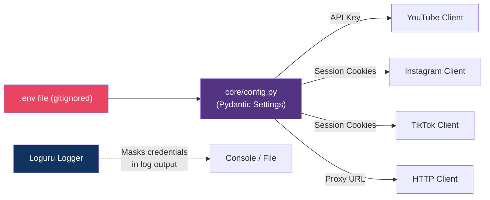
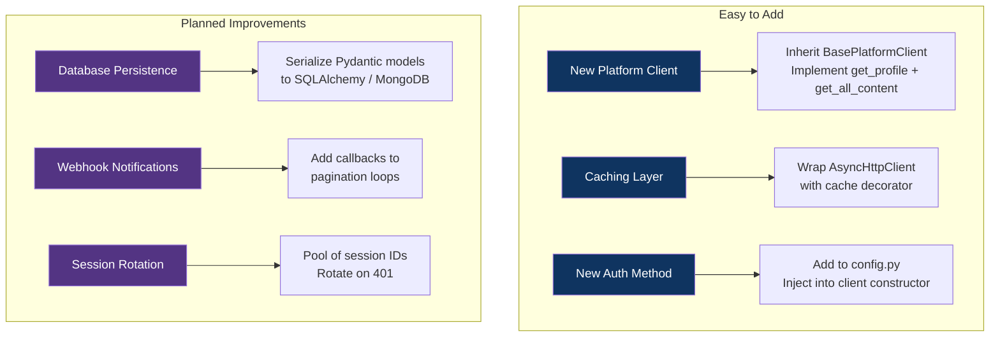

# 🏗️ Architecture & System Design

> This document describes the internal design of the Social Media SDK — its layered architecture, data flow pipelines, design patterns, and the engineering rationale behind each decision.

---

## System Overview

```mermaid
graph TB
    subgraph "User Application"
        APP[Your Code / example_usage.py]
    end

    subgraph "Platform Layer"
        BASE[BasePlatformClient — Abstract Interface]
        YT[YouTubeClient]
        IG[InstagramClient]
        TT[TikTokClient]
    end

    subgraph "Core Infrastructure"
        HTTP[AsyncHttpClient]
        RL[RateLimiter — Token Bucket]
        RT[@async_retry — Exponential Backoff]
        CFG[Settings — Pydantic .env Loader]
    end

    subgraph "Data Layer"
        MP[Profile Model]
        MC[Content Model]
    end

    subgraph "External Services"
        YTAPI[YouTube Data API v3]
        IGAPI[Instagram Web API]
        TTAPI[TikTok Web API]
    end

    APP --> YT & IG & TT
    YT & IG & TT --> BASE
    YT & IG & TT --> HTTP
    HTTP --> RL
    HTTP --> RT
    HTTP --> YTAPI & IGAPI & TTAPI
    YT & IG & TT --> MP & MC
    CFG -.-> HTTP
    CFG -.-> YT & IG & TT

    style APP fill:#1a1a2e,stroke:#e94560,color:#fff
    style BASE fill:#16213e,stroke:#0f3460,color:#fff
    style YT fill:#0f3460,stroke:#533483,color:#fff
    style IG fill:#0f3460,stroke:#533483,color:#fff
    style TT fill:#0f3460,stroke:#533483,color:#fff
    style HTTP fill:#533483,stroke:#e94560,color:#fff
    style RL fill:#533483,stroke:#e94560,color:#fff
    style RT fill:#533483,stroke:#e94560,color:#fff
    style CFG fill:#533483,stroke:#e94560,color:#fff
    style MP fill:#2b2d42,stroke:#8d99ae,color:#fff
    style MC fill:#2b2d42,stroke:#8d99ae,color:#fff
    style YTAPI fill:#e94560,stroke:#1a1a2e,color:#fff
    style IGAPI fill:#e94560,stroke:#1a1a2e,color:#fff
    style TTAPI fill:#e94560,stroke:#1a1a2e,color:#fff
```

---

## Design Principles

### 1. Clean Architecture — Layered Separation

The SDK follows **Clean Architecture** (Robert C. Martin). Dependencies always flow **inward** — outer layers know about inner layers, never the reverse.



**What this enables:**

- Add a new platform **without touching** Core
- Replace the HTTP library **without touching** any platform client
- Test each layer **independently** with mock injection

### 2. Dependency Injection

Platform clients don't create their own HTTP clients — they **receive** one via constructor:

```python
# One HTTP client shared across all platforms
http_client = AsyncHttpClient(rate_limiter=limiter, proxy_url="...")

yt = YouTubeClient(http_client, api_key="...")      # injected
ig = InstagramClient(http_client, session_id="...")  # same client reused
```

### 3. Strategy Pattern — Platform Abstraction

All platform clients implement `BasePlatformClient`:



### 4. Decorator Pattern — Retry Logic

The `@async_retry` transparently wraps `AsyncHttpClient.request()`, keeping retry logic completely separate from business logic:

```python
class AsyncHttpClient:
    @async_retry(max_retries=3, base_delay=2.0)   # ← transparent wrapper
    async def request(self, method, url, ...):
        ...  # clean request logic, no retry code here
```

---

## Request Lifecycle

Every API call flows through the same pipeline:



---

## Pagination Engine

All platforms implement the same **cursor-based pagination** pattern:



**Platform cursor mapping:**

| Platform  | Cursor Field (Response) | Cursor Param (Request) | Stop Condition    |
| --------- | ----------------------- | ---------------------- | ----------------- |
| YouTube   | `nextPageToken`         | `pageToken`            | Token is `null`   |
| Instagram | `next_max_id`           | `max_id`               | Field is absent   |
| TikTok    | `cursor` + `hasMore`    | `cursor`               | `hasMore = false` |

---

## Rate Limiting — Token Bucket



**Why Token Bucket over fixed delay?**

- Fixed delay: 1 req every 500ms = always 2 req/s, even if API allows burst
- Token Bucket: Accumulate tokens during idle time, burst when needed, smooth over sustained load

---

## Error Handling Strategy



---

## Security Model



**Principles:**

1. Credentials live **only** in `.env` (gitignored)
2. Logger never exposes full API keys or session tokens
3. Session cookies have expiration — the SDK raises clear errors on auth failure
4. Proxy support enables IP rotation for anti-detection

---

## Extension Points


