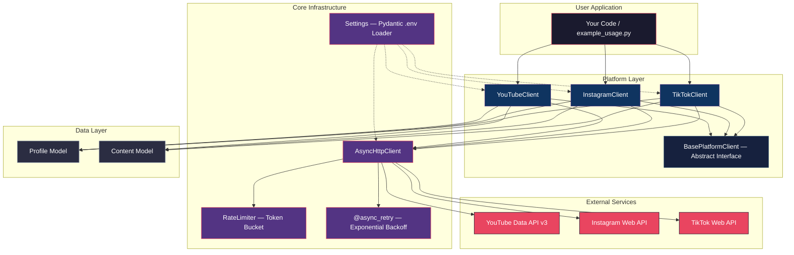
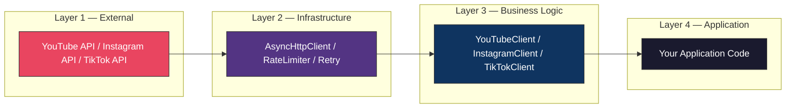
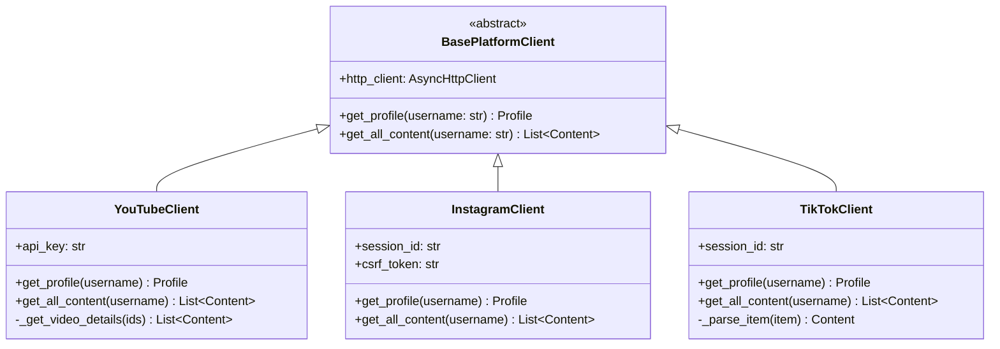
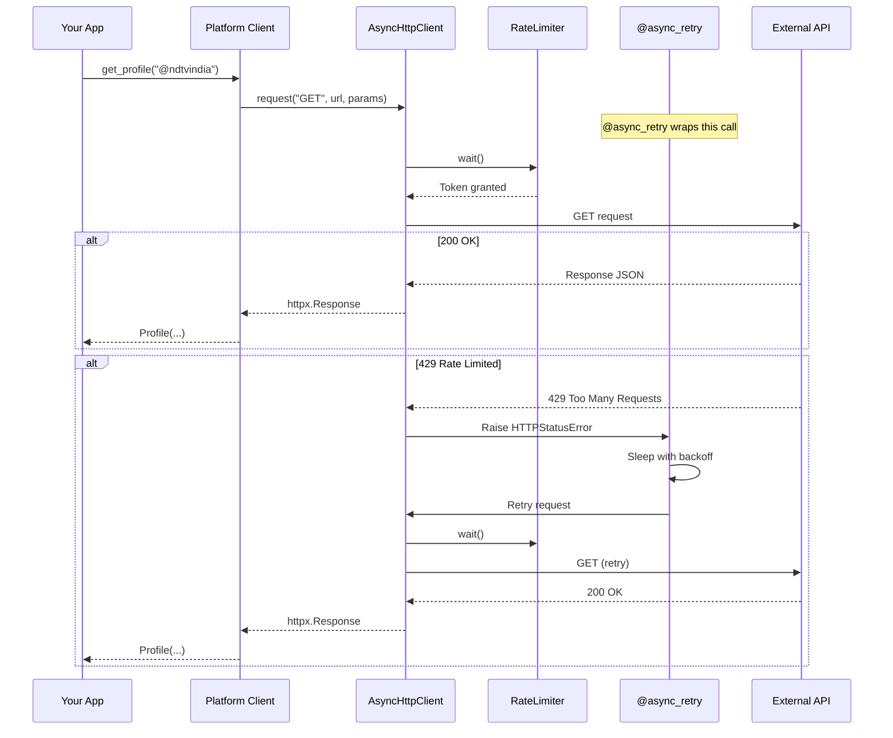
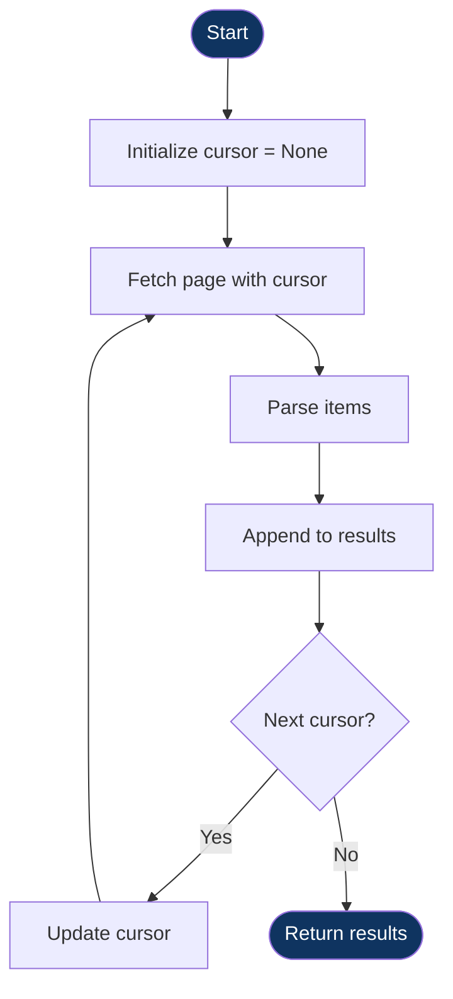
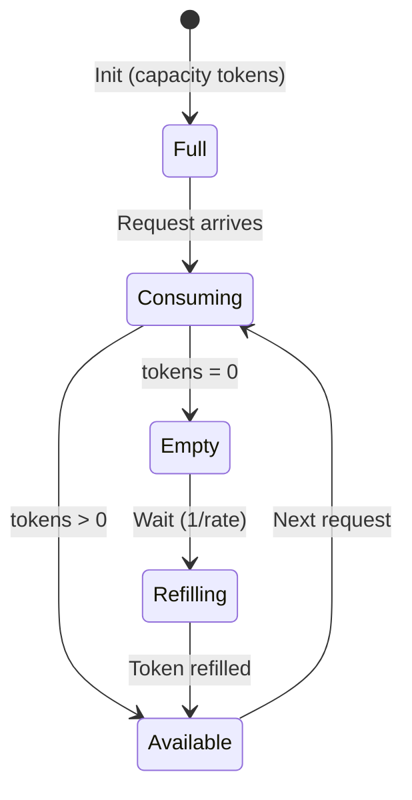
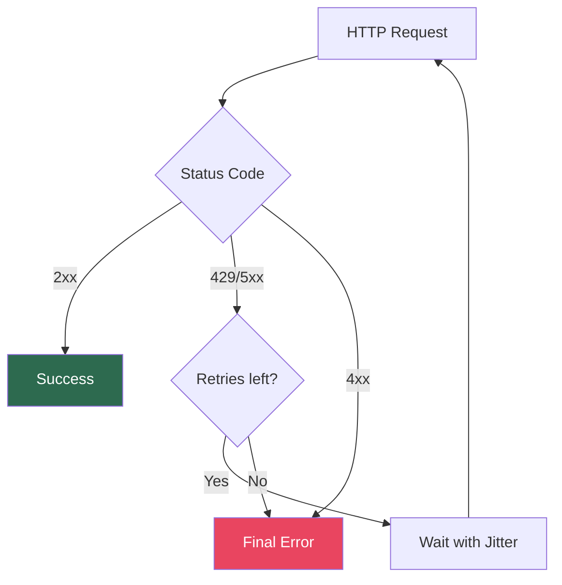

# Architecture and System Design

This document describes the internal design of the Social Media SDK — its layered architecture, data flow pipelines, design patterns, and the engineering rationale behind each decision.

---

## System Overview



---

## Design Principles

### 1. Layered Separation

The SDK follows a layered architecture where dependencies always flow inward. This ensures that outer layers know about inner layers, but not the reverse.



**Benefits:**

- Add a new platform without modifying core infrastructure.
- Replace the HTTP library without touching platform clients.
- Test each layer independently with mock injection.

### 2. Dependency Injection

Platform clients receive their dependencies (like the HTTP client) via constructor, promoting reusability and testability:

```python
# One HTTP client shared across all platforms
http_client = AsyncHttpClient(rate_limiter=limiter)

yt = YouTubeClient(http_client, api_key="...")
ig = InstagramClient(http_client, session_id="...")
```

### 3. Strategy Pattern

All platform clients implement the `BasePlatformClient` interface, ensuring consistent behavior across different social media providers.



### 4. Retry Logic

The `@async_retry` decorator wraps `AsyncHttpClient.request()`, keeping retry logic isolated from business logic.

---

## Request Lifecycle

Every API call flows through a standardized pipeline:



---

## Pagination Engine

All platforms implement cursor-based pagination:



| Platform  | Cursor Field (Response) | Cursor Param (Request) | Stop Condition    |
| --------- | ----------------------- | ---------------------- | ----------------- |
| YouTube   | `nextPageToken`         | `pageToken`            | Token is `null`   |
| Instagram | `next_max_id`           | `max_id`               | Field is absent   |
| TikTok    | `cursor` + `hasMore`    | `cursor`               | `hasMore = false` |

---

## Rate Limiting

The SDK uses a **Token Bucket** algorithm for request pacing.



- **Efficiency**: Allows bursts while maintaining a consistent throughput over time compared to fixed-delay limiting.

---

## Error Handling



---

## Security Model

1. **Credentials**: Stored only in `.env` (gitignored).
2. **Log Masking**: Credentials are never exposed in logs.
3. **Session Management**: SDK raises clear errors on auth failure.

---

## Extension Points

- **New Platforms**: Inherit `BasePlatformClient` and implement core methods.
- **Caching**: Wrap `AsyncHttpClient` with a caching decorator.
- **Persistence**: Serialize Pydantic models to a database.
