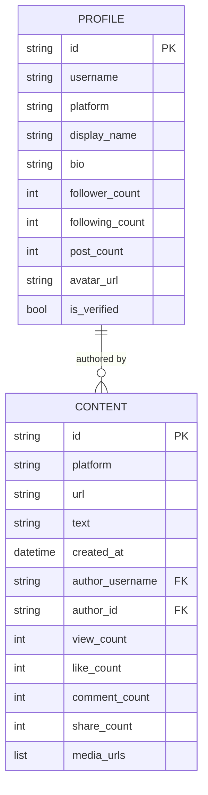
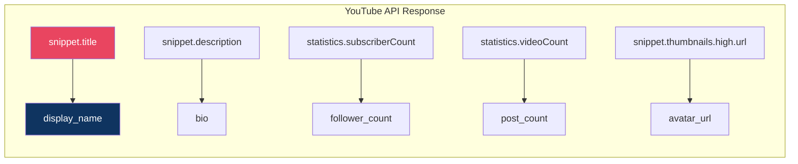

# Data Models Reference

All platform outputs are normalized into two Pydantic v2 models. This ensures consistent, type-safe data regardless of the source platform.

---

## Model Relationship

---

## Profile — Creator Schema

**Source:** `models/profile.py`

| Field             | Type   | Default    | Description                               |
| :---------------- | :----- | :--------- | :---------------------------------------- | ------------------- |
| `id`              | `str`  | _required_ | Platform-specific user/channel ID         |
| `username`        | `str`  | _required_ | Handle or username                        |
| `platform`        | `str`  | _required_ | `"youtube"`, `"instagram"`, or `"tiktok"` |
| `display_name`    | `str   | None`      | `None`                                    | Human-readable name |
| `bio`             | `str   | None`      | `None`                                    | Profile description |
| `follower_count`  | `int`  | `0`        | Subscribers / followers                   |
| `following_count` | `int`  | `0`        | Following count                           |
| `post_count`      | `int`  | `0`        | Total videos / posts                      |
| `avatar_url`      | `str   | None`      | `None`                                    | Profile picture URL |
| `is_verified`     | `bool` | `False`    | Verification status                       |

### Platform Mapping

---

## Content — Post Schema

**Source:** `models/content.py`

| Field             | Type        | Default    | Description                  |
| :---------------- | :---------- | :--------- | :--------------------------- | --------------------------- |
| `id`              | `str`       | _required_ | Platform-specific content ID |
| `platform`        | `str`       | _required_ | Source platform              |
| `url`             | `str`       | _required_ | Direct URL to content        |
| `text`            | `str        | None`      | `None`                       | Video title or post caption |
| `created_at`      | `datetime   | None`      | `None`                       | Publication timestamp       |
| `author_username` | `str`       | _required_ | Creator's username           |
| `author_id`       | `str`       | _required_ | Creator's platform ID        |
| `view_count`      | `int`       | `0`        | View / play count            |
| `like_count`      | `int`       | `0`        | Like count                   |
| `comment_count`   | `int`       | `0`        | Comment count                |
| `share_count`     | `int`       | `0`        | Share count                  |
| `media_urls`      | `List[str]` | `[]`       | Media file URLs              |

### Cross-Platform Comparison

| SDK Field       | YouTube                   | Instagram            | TikTok               |
| :-------------- | :------------------------ | :------------------- | :------------------- |
| `id`            | `video.id`                | `item.id`            | `item.id`            |
| `text`          | `snippet.title`           | `caption.text`       | `item.desc`          |
| `url`           | `youtube.com/watch?v=...` | `p/CODE/`            | `@user/video/ID`     |
| `view_count`    | `statistics.viewCount`    | `item.view_count`    | `stats.playCount`    |
| `like_count`    | `statistics.likeCount`    | `item.like_count`    | `stats.diggCount`    |
| `comment_count` | `statistics.commentCount` | `item.comment_count` | `stats.commentCount` |
| `share_count`   | N/A                       | N/A                  | `stats.shareCount`   |
| `media_urls`    | Thumbnail                 | Image versions       | Video address        |
