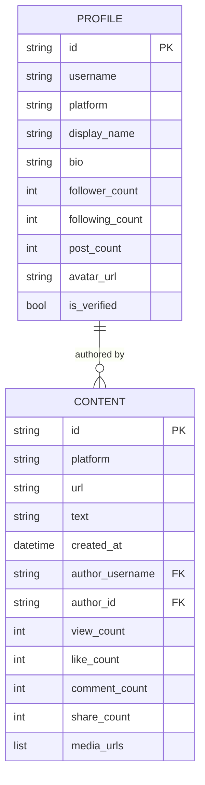
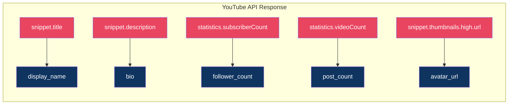

# 📐 Data Models Reference

> All platform outputs are normalized into two Pydantic v2 models. This ensures consistent, type-safe data regardless of source platform.

---

## Model Relationship



---

## `Profile` — Creator/Channel Schema

**Source:** `models/profile.py`

| Field             | Type           | Default    | Description                                         |
| ----------------- | -------------- | ---------- | --------------------------------------------------- |
| `id`              | `str`          | _required_ | Platform-specific user/channel ID                   |
| `username`        | `str`          | _required_ | Handle or username                                  |
| `platform`        | `str`          | _required_ | `"youtube"`, `"instagram"`, or `"tiktok"`           |
| `display_name`    | `str \| None`  | `None`     | Human-readable name                                 |
| `bio`             | `str \| None`  | `None`     | Profile description / about                         |
| `follower_count`  | `int`          | `0`        | Subscribers / followers                             |
| `following_count` | `int`          | `0`        | Following count                                     |
| `post_count`      | `int`          | `0`        | Total videos / posts                                |
| `avatar_url`      | `str \| None`  | `None`     | Profile picture URL                                 |
| `is_verified`     | `bool`         | `False`    | Verification badge                                  |
| `raw_data`        | `dict \| None` | `None`     | Original API response (excluded from serialization) |

### Platform Mapping



### Serialization

```python
profile = await yt.get_profile("@ndtvindia")

# To dictionary
data = profile.model_dump()

# To JSON string
json_str = profile.model_dump_json(indent=2)

# Note: raw_data is excluded from serialization by default
```

---

## `Content` — Video/Post Schema

**Source:** `models/content.py`

| Field             | Type               | Default    | Description                      |
| ----------------- | ------------------ | ---------- | -------------------------------- |
| `id`              | `str`              | _required_ | Platform-specific content ID     |
| `platform`        | `str`              | _required_ | Source platform                  |
| `url`             | `str`              | _required_ | Direct URL to content            |
| `text`            | `str \| None`      | `None`     | Video title or post caption      |
| `created_at`      | `datetime \| None` | `None`     | Publication timestamp            |
| `author_username` | `str`              | _required_ | Creator's username               |
| `author_id`       | `str`              | _required_ | Creator's platform ID            |
| `view_count`      | `int`              | `0`        | View / play count                |
| `like_count`      | `int`              | `0`        | Like / heart count               |
| `comment_count`   | `int`              | `0`        | Comment count                    |
| `share_count`     | `int`              | `0`        | Share / repost count             |
| `media_urls`      | `List[str]`        | `[]`       | Image / video file URLs          |
| `raw_data`        | `dict \| None`     | `None`     | Original API response (excluded) |

### Cross-Platform Comparison

| SDK Field       | YouTube                   | Instagram               | TikTok                      |
| --------------- | ------------------------- | ----------------------- | --------------------------- |
| `id`            | `video.id`                | `item.id`               | `item.id`                   |
| `text`          | `snippet.title`           | `caption.text`          | `item.desc`                 |
| `url`           | `youtube.com/watch?v=...` | `instagram.com/p/CODE/` | `tiktok.com/@user/video/ID` |
| `view_count`    | `statistics.viewCount`    | `item.view_count`       | `stats.playCount`           |
| `like_count`    | `statistics.likeCount`    | `item.like_count`       | `stats.diggCount`           |
| `comment_count` | `statistics.commentCount` | `item.comment_count`    | `stats.commentCount`        |
| `share_count`   | _(not available)_         | _(not available)_       | `stats.shareCount`          |
| `media_urls`    | _(thumbnail only)_        | `image_versions2`       | `video.downloadAddr`        |
