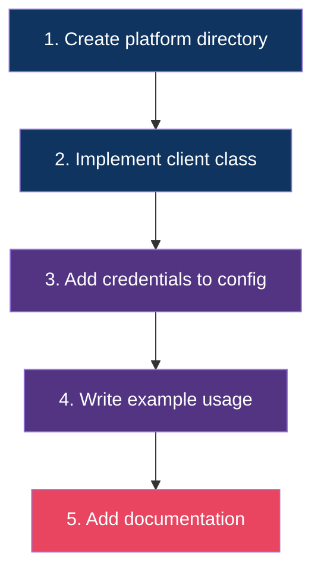

# 🔌 Extending the SDK — Adding a New Platform

This guide walks you through adding support for a new social media platform (e.g., Twitter/X, LinkedIn, Facebook).

---

## Overview



---

## Step 1: Create the Platform Directory

```bash
mkdir platforms/twitter
touch platforms/twitter/__init__.py
touch platforms/twitter/client.py
```

---

## Step 2: Implement the Client

Create `platforms/twitter/client.py`:

```python
from typing import List, Optional
from loguru import logger
from ..base import BasePlatformClient
from models.profile import Profile
from models.content import Content


class TwitterClient(BasePlatformClient):
    """Twitter/X platform client."""

    BASE_URL = "https://api.twitter.com/2"

    def __init__(self, http_client, bearer_token: str):
        super().__init__(http_client)
        self.bearer_token = bearer_token

    async def get_profile(self, username: str) -> Profile:
        """Fetch a Twitter user's profile."""
        # Remove @ if present
        username = username.lstrip("@")

        response = await self.http_client.request(
            "GET",
            f"{self.BASE_URL}/users/by/username/{username}",
            headers={"Authorization": f"Bearer {self.bearer_token}"},
            params={
                "user.fields": "description,public_metrics,profile_image_url,verified"
            },
        )
        data = response.json()["data"]

        return Profile(
            id=data["id"],
            username=data["username"],
            platform="twitter",
            display_name=data.get("name"),
            bio=data.get("description"),
            follower_count=data.get("public_metrics", {}).get("followers_count", 0),
            following_count=data.get("public_metrics", {}).get("following_count", 0),
            post_count=data.get("public_metrics", {}).get("tweet_count", 0),
            avatar_url=data.get("profile_image_url"),
            is_verified=data.get("verified", False),
            raw_data=data,
        )

    async def get_all_content(self, username: str) -> List[Content]:
        """Fetch all tweets for a user with pagination."""
        profile = await self.get_profile(username)
        all_content = []
        pagination_token = None

        while True:
            params = {
                "max_results": 100,
                "tweet.fields": "created_at,public_metrics",
            }
            if pagination_token:
                params["pagination_token"] = pagination_token

            response = await self.http_client.request(
                "GET",
                f"{self.BASE_URL}/users/{profile.id}/tweets",
                headers={"Authorization": f"Bearer {self.bearer_token}"},
                params=params,
            )
            data = response.json()

            for tweet in data.get("data", []):
                metrics = tweet.get("public_metrics", {})
                all_content.append(Content(
                    id=tweet["id"],
                    platform="twitter",
                    url=f"https://x.com/{username}/status/{tweet['id']}",
                    text=tweet.get("text"),
                    created_at=tweet.get("created_at"),
                    author_username=username,
                    author_id=profile.id,
                    view_count=metrics.get("impression_count", 0),
                    like_count=metrics.get("like_count", 0),
                    comment_count=metrics.get("reply_count", 0),
                    share_count=metrics.get("retweet_count", 0),
                ))

            pagination_token = data.get("meta", {}).get("next_token")
            if not pagination_token:
                break

            logger.info(f"Fetched {len(all_content)} tweets so far...")

        return all_content
```

---

## Step 3: Add Credentials to Config

In `core/config.py`, add the new credential field:

```python
class Settings(BaseSettings):
    # ... existing fields ...

    # Twitter Configuration
    TWITTER_BEARER_TOKEN: Optional[str] = None
```

In `.env.example`:

```env
# Twitter
TWITTER_BEARER_TOKEN=your_bearer_token_here
```

---

## Step 4: Write Example Usage

Add to `examples/example_usage.py` or create a new example:

```python
from platforms.twitter.client import TwitterClient

if settings.TWITTER_BEARER_TOKEN:
    tw = TwitterClient(http_client, bearer_token=settings.TWITTER_BEARER_TOKEN)
    profile = await tw.get_profile("@elonmusk")
    tweets = await tw.get_all_content("@elonmusk")
```

---

## Step 5: Add Documentation

Create `docs/twitter-guide.md` following the same structure as the YouTube/Instagram/TikTok guides.

---

## Checklist

- [ ] Client class inherits `BasePlatformClient`
- [ ] Implements both `get_profile()` and `get_all_content()`
- [ ] Uses `self.http_client.request()` — never raw `httpx`
- [ ] Returns `Profile` and `List[Content]` models
- [ ] Handles pagination with cursor/token
- [ ] Credentials added to `core/config.py` and `.env.example`
- [ ] Documentation added to `docs/`
