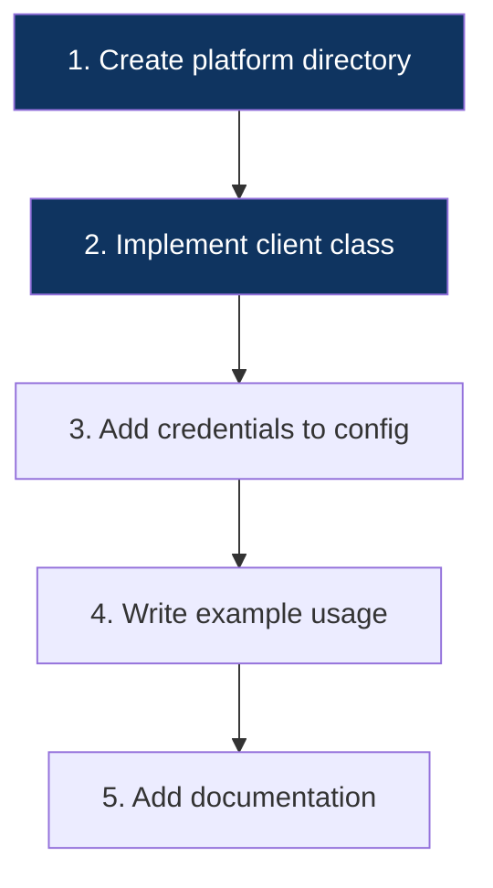

# Extending the SDK — Adding a New Platform

This guide walks you through adding support for a new social media platform (e.g., Twitter/X, LinkedIn, Facebook).

---

## Overview



---

## Step 1: Create the Platform Directory

```bash
mkdir platforms/twitter
touch platforms/twitter/__init__.py
touch platforms/twitter/client.py
```

---

## Step 2: Implement the Client

Create `platforms/twitter/client.py`:

```python
from typing import List, Optional
from loguru import logger
from ..base import BasePlatformClient
from models.profile import Profile
from models.content import Content

class TwitterClient(BasePlatformClient):
    """Twitter/X platform client."""
    BASE_URL = "https://api.twitter.com/2"

    def __init__(self, http_client, bearer_token: str):
        super().__init__(http_client)
        self.bearer_token = bearer_token

    async def get_profile(self, username: str) -> Profile:
        """Fetch a Twitter user's profile."""
        username = username.lstrip("@")
        response = await self.http_client.request(
            "GET",
            f"{self.BASE_URL}/users/by/username/{username}",
            headers={"Authorization": f"Bearer {self.bearer_token}"},
            params={"user.fields": "description,public_metrics,profile_image_url,verified"},
        )
        data = response.json()["data"]
        return Profile(...)

    async def get_all_content(self, username: str) -> List[Content]:
        """Fetch content with pagination."""
        # ... implementation ...
```

---

## Step 3: Configuration

In `core/config.py`:

```python
class Settings(BaseSettings):
    TWITTER_BEARER_TOKEN: Optional[str] = None
```

In `.env.example`:

```env
TWITTER_BEARER_TOKEN=your_token_here
```

---

## checklist

- [ ] Client class inherits `BasePlatformClient`.
- [ ] Implements `get_profile` and `get_all_content`.
- [ ] Uses `self.http_client.request` for all external calls.
- [ ] Returns sanitized `Profile` and `Content` models.
- [ ] Handles pagination.
- [ ] Records added to `core/config.py` and `.env.example`.
